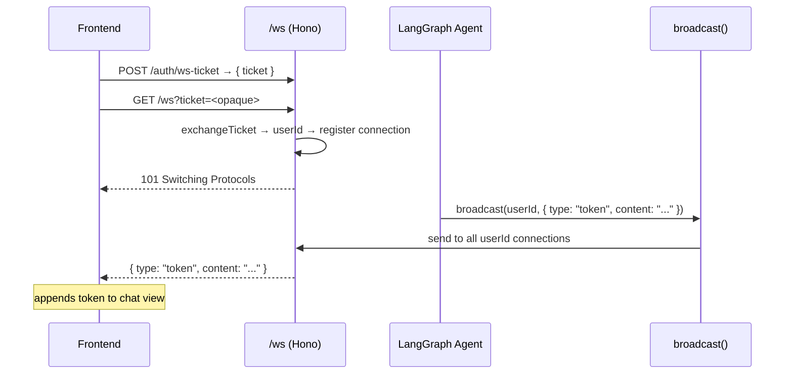

# Delta Spec: 001-firebase-inspired-layer

> All capabilities are new. Each section uses full spec format under `### ADDED`.

---

## ### ADDED — auth-webauthn

**Package**: `packages/backend/src/auth/`

### Requirement: WebAuthn Passkey Registration

The system MUST support WebAuthn passkey registration via `@simplewebauthn/server`. On registration, the system SHALL store the credential (id, public key, counter) linked to the user record in the `users` table. The system MUST NOT store passwords.

#### Scenario: Successful passkey registration

- GIVEN a new user submits a registration request
- WHEN the server validates the WebAuthn registration response
- THEN the credential is stored in DB and the user is created

#### Scenario: Duplicate credential rejected

- GIVEN a credential ID already exists in DB
- WHEN the same credential is submitted for registration
- THEN the system returns HTTP 409 and does not create a duplicate

---

### Requirement: WebAuthn Challenge One-Time Use

The challenge issued during `register/challenge` and `login/challenge` MUST be deleted from the challenge store immediately after the corresponding `verify` call completes, regardless of whether verification succeeds or fails. Challenges MUST NOT be reusable.

---

### Requirement: WebAuthn Authentication + JWT Issuance

The system MUST validate the WebAuthn authentication assertion and, on success, issue a signed JWT access token and a refresh token. Tokens SHALL be signed with `JWT_SECRET` from Infisical. Access token expiry SHOULD be 15 minutes; refresh token expiry SHOULD be 7 days.

#### Scenario: Successful authentication

- GIVEN a user has a registered passkey
- WHEN the authentication assertion is verified
- THEN the system issues access token + refresh token and returns HTTP 200

#### Scenario: Invalid assertion rejected

- GIVEN an authentication assertion with bad signature
- WHEN the server validates the assertion
- THEN the system returns HTTP 401 and issues no tokens

---

### Requirement: JWT Middleware

The system MUST provide middleware at `packages/backend/src/auth/middleware.ts` that validates the JWT on every protected route. The middleware SHALL reject requests with expired or invalid tokens with HTTP 401.

#### Scenario: Valid token passes through

- GIVEN a request with a valid JWT in Authorization header
- WHEN the middleware validates the token
- THEN the request proceeds to the handler with `userId` in context

#### Scenario: Dev fallback mode

- GIVEN `WEBAUTHN_DISABLED=true` in environment
- WHEN a client requests authentication
- THEN the system MAY issue JWT tokens without WebAuthn assertion validation

#### Scenario: WEBAUTHN_DISABLED blocked in production

- GIVEN `WEBAUTHN_DISABLED=true` AND `NODE_ENV=production`
- WHEN the server starts
- THEN the server MUST call `process.exit(1)` immediately with a clear error message; `WEBAUTHN_DISABLED=true` MUST NOT be permitted in production

---

```mermaid
sequenceDiagram
    participant B as Browser
    participant S as Backend /auth
    participant DB as SQLite

    B->>S: POST /auth/register/begin
    S-->>B: registration options (challenge)
    B->>B: navigator.credentials.create()
    B->>S: POST /auth/register/finish (response)
    S->>S: verifyRegistrationResponse()
    S->>DB: INSERT users + credentials
    S-->>B: 200 OK

    B->>S: POST /auth/login/begin
    S-->>B: authentication options (challenge)
    B->>B: navigator.credentials.get()
    B->>S: POST /auth/login/finish (response)
    S->>S: verifyAuthenticationResponse()
    S-->>B: { accessToken } + Set-Cookie: refreshToken (HttpOnly; SameSite=Strict)
```

### Requirement: Refresh Token Storage

The refresh token MUST be stored in an `HttpOnly SameSite=Strict` cookie set by the server via the `Set-Cookie` response header in `/auth/login/verify` and `/auth/refresh`. The refresh token MUST NOT be returned in the response body. The client MUST NOT be able to access the refresh token via JavaScript.

---

### Requirement: Logout (Client-Side)

Logout is client-side only. On `DELETE /auth/logout`, the server MUST clear the refresh token `HttpOnly` cookie in the response (set expired `Set-Cookie`). The access token remains valid until its 15-minute expiry — server-side revocation is deferred to F.2 (`refresh_tokens` table). The client MUST discard the in-memory access token on logout.

> **Note**: `logout` MUST clear the refresh token HttpOnly cookie on client; server-side revocation is deferred to F.2 (refresh_tokens table). Until F.2 is implemented, a stolen refresh token remains valid for up to 7 days.

---

> **Known Limitation — isAdmin revocation**: `isAdmin` is embedded in the JWT access token with a 15-minute lifetime. Admin privilege revocation takes effect only after the current access token expires (up to 15-minute delay). This is an accepted trade-off for the intranet use case. The admin panel SHOULD display a notice to this effect. Full per-request revocation support requires a DB lookup and is deferred.

---

## ### ADDED — db-sqlite-repos

**Package**: `packages/backend/src/db/`

### Requirement: SQLite WAL Mode and Schema

The system MUST enable WAL mode on SQLite startup. The system SHALL enforce foreign keys. The following tables MUST exist: `users`, `sessions`, `messages`, `tasks`, `artifacts`, `feature_flags`, `job_queue`.

Schema:

| Table | Key Columns |
|-------|------------|
| users | id, display_name, created_at |
| sessions | id, user_id (FK→users), title, created_at, archived_at |
| messages | id, session_id (FK→sessions), role (user\|assistant\|tool), content, created_at |
| tasks | id, session_id (FK→sessions), title, status (pending\|in_progress\|done\|blocked), created_at, updated_at |
| artifacts | id, user_id (FK→users), session_id, filename, mime_type, size_bytes, storage_path, signed_url_token, signed_url_expires_at, created_at |
| feature_flags | key PK, value (JSON), description, updated_at |
| job_queue | id, type, payload (JSON), status (pending\|processing\|done\|failed), processing_at, created_at, updated_at, error |

#### Scenario: WAL mode active on startup

- GIVEN the backend process starts
- WHEN the SQLite connection is initialized
- THEN `PRAGMA journal_mode=WAL` is applied and confirmed

#### Scenario: FK violation rejected

- GIVEN a messages insert with a non-existent session_id
- WHEN the repository attempts to insert
- THEN the DB raises a FK constraint error and the insert is rolled back

---

### Requirement: Typed Repository Classes

Each table MUST have a corresponding TypeScript class in `packages/backend/src/db/repos/` with CRUD methods typed with TypeScript strict mode (`exactOptionalPropertyTypes`, `noUncheckedIndexedAccess`). Each repo SHALL expose at minimum: `findById`, `create`, `update`, `delete`, `list`.

#### Scenario: Typed CRUD round-trip

- GIVEN a `UsersRepo` instance
- WHEN `create({ displayName: "Ada" })` is called
- THEN a user row is inserted and `findById` returns the typed record

---

## ### ADDED — storage-filesystem

**Package**: `packages/backend/src/storage/`

### Requirement: File Upload and Storage

The system MUST store uploaded files at `{STORAGE_BASE_PATH}/{user_id}/{artifact_id}/`. The `upload(userId, sessionId, file)` method SHALL create the artifact directory, write the file, persist an artifact record in DB, and return the artifact record with a signed URL.

#### Scenario: Successful upload

- GIVEN a valid userId, sessionId, and file buffer
- WHEN `upload()` is called
- THEN the file is written to NAS and an artifact record with a signed URL is returned

#### Scenario: Missing base path

- GIVEN `STORAGE_BASE_PATH` is not set
- WHEN the storage service initializes
- THEN the system throws a configuration error and does not start

---

### Requirement: Signed URL Download

The `download(userId, artifactId, token)` method MUST validate a signed URL token (HMAC-SHA256 of `artifactId + userId + expires`). `verifyToken` MUST check `expiresAt > Date.now()`; expired tokens MUST return HTTP 403. Tokens with invalid HMAC signatures MUST also return HTTP 403. Valid tokens SHALL return a readable stream of the file. Default TTL SHOULD be 1 hour and MUST be configurable.

#### Scenario: Valid token returns file stream

- GIVEN a valid, non-expired signed token
- WHEN `download()` is called
- THEN a readable stream of the artifact is returned

#### Scenario: Expired token rejected

- GIVEN a token whose `expires` timestamp is in the past
- WHEN `download()` is called
- THEN the system returns HTTP 403

---

### Requirement: Artifact Ownership Enforcement

All `ArtifactsRepo` read queries MUST include `AND user_id = :userId` in the WHERE clause. If an artifact exists but belongs to a different user, the system MUST return HTTP 404 (not HTTP 403) to prevent user enumeration.

---

### Requirement: Filename Sanitization

`StorageService` MUST apply `path.basename()` to the uploaded filename before constructing the storage path. Filenames containing `/` (path separator) or null bytes (`\0`) MUST be rejected with HTTP 400 before any file write occurs.

---

### Requirement: Artifact Listing

`list(userId, sessionId?)` MUST return all artifacts for the user, optionally filtered by sessionId. The list MUST NOT include artifacts belonging to other users.

#### Scenario: User isolation on list

- GIVEN user A and user B each have artifacts
- WHEN user A calls `list(userA.id)`
- THEN only user A's artifacts are returned

---

## ### ADDED — feature-flags

**Package**: `packages/backend/src/flags/`

### Requirement: Flag Read / Write with Cache

`getFlag(key)` MUST return the parsed JSON value from an in-memory cache (5-min TTL); on cache miss, read from `feature_flags` table. `setFlag(key, value)` MUST update the DB and invalidate the cache entry. `listFlags()` MUST return all flags, bypassing cache.

#### Scenario: Cache hit within TTL

- GIVEN a flag was fetched 2 minutes ago
- WHEN `getFlag(key)` is called again
- THEN the value is returned from cache without a DB query

#### Scenario: setFlag invalidates cache

- GIVEN a flag is cached
- WHEN `setFlag(key, newValue)` is called
- THEN the cache entry is removed and the next `getFlag` reads from DB

---

### Requirement: Admin API for Flags

The system MUST expose `GET /admin/flags`, `POST /admin/flags`, and `PATCH /admin/flags/:key` endpoints. These routes MUST be protected by JWT middleware and MUST require the `isAdmin` claim.

#### Scenario: Admin lists flags

- GIVEN an authenticated admin user
- WHEN `GET /admin/flags` is called
- THEN all feature flags are returned as JSON

#### Scenario: Non-admin blocked

- GIVEN an authenticated non-admin user
- WHEN any `/admin/flags` route is accessed
- THEN HTTP 403 is returned

---

## ### ADDED — realtime-ws

**Package**: `packages/backend/src/realtime/`

### Requirement: WebSocket Endpoint and Auth

The system MUST expose `GET /ws` using Hono `upgradeWebSocket`. JWT MUST NOT be passed as a URL query parameter (it would be logged verbatim by every proxy and reverse proxy). Instead, the client MUST first obtain a short-lived opaque WS ticket by calling `POST /auth/ws-ticket` (authenticated via Bearer token), then pass the ticket as `?ticket=<opaque>` in the WebSocket URL. The server MUST exchange the ticket for a `userId` on WebSocket upgrade and reject unknown or expired tickets with close code 4001. Unauthenticated connections MUST be closed with code 4001.

#### Scenario: Authenticated connection accepted

- GIVEN a client sends a valid JWT
- WHEN the WebSocket handshake completes
- THEN the connection is registered in the per-user connection map

#### Scenario: Unauthenticated connection rejected

- GIVEN no token is provided
- WHEN the WebSocket upgrade is attempted
- THEN the connection is closed with code 4001

---

### Requirement: Broadcast and Web Push

`broadcast(userId, event)` MUST send the serialized event to all open WebSocket connections for that user. If no connection is open, the system SHOULD fall back to Web Push if the user has a stored VAPID subscription. VAPID keys MUST be loaded from `VAPID_PUBLIC_KEY` / `VAPID_PRIVATE_KEY` env vars.

#### Scenario: Agent streams tokens to frontend

- GIVEN a user has an active WebSocket connection
- WHEN the agent emits a token event via `broadcast(userId, event)`
- THEN the token payload is delivered to all user connections in real time

#### Scenario: Graceful disconnect and reconnect

- GIVEN a user's WebSocket disconnects
- WHEN the client reconnects with a valid token
- THEN the connection is re-registered and broadcast resumes without error

---



---

## ### ADDED — job-queue

**Package**: `packages/backend/src/workers/` (client) · `packages/workers/` (sidecar)

### Requirement: Job Enqueue

`enqueue(type, payload)` MUST insert a row into `job_queue` with `status=pending`. The method SHALL be synchronous (blocking SQLite insert). All job types MUST be registered with a handler in the workers sidecar before being enqueued.

#### Scenario: Job enqueued and visible

- GIVEN the backend calls `enqueue("indexCodebase", { path: "/src" })`
- WHEN the job_queue table is queried
- THEN a row with `status=pending` and the correct payload exists

---

### Requirement: Worker Polling and Execution

The workers sidecar MUST poll for `status=pending` jobs every 5 seconds, set `status=processing` and `processing_at=now()`, execute the handler, then set `status=done` or `status=failed` (with `error`). Jobs with `processing_at` older than 5 minutes MUST be reset to `status=pending` on the next poll cycle.

#### Scenario: Successful job execution

- GIVEN a pending `indexCodebase` job
- WHEN the worker picks it up
- THEN the handler runs, and the job transitions to `done`

#### Scenario: Stuck job recovery

- GIVEN a job with `status=processing` and `processing_at` > 5 min ago
- WHEN the worker polls
- THEN the job is reset to `pending` and re-queued

---

### Requirement: Scheduled archiveSessions Job

The workers sidecar MUST run `archiveSessions` on a daily schedule. The handler SHALL set `archived_at=now()` on all sessions with `created_at` older than 90 days that are not already archived.

### Requirement: archiveSessions Self-Enqueue Logic

On worker startup, and after each `archiveSessions` job completes, the handler MUST check whether a pending or done `archiveSessions` job already exists with `created_at >= date('now')`. If no such job is found, a new `archiveSessions` job MUST be enqueued. This ensures exactly one archive run per calendar day without an external scheduler (cron, systemd timer, etc.).

#### Scenario: Daily archive run

- GIVEN sessions older than 90 days exist without `archived_at`
- WHEN the daily `archiveSessions` job runs
- THEN all qualifying sessions have `archived_at` set

#### Scenario: Self-enqueue on startup

- GIVEN no `archiveSessions` job with `created_at >= date('now')` exists
- WHEN the workers sidecar starts
- THEN a new `archiveSessions` job is enqueued immediately

#### Scenario: No duplicate enqueue

- GIVEN an `archiveSessions` job with `created_at >= date('now')` already exists (status `pending` or `done`)
- WHEN the workers sidecar starts or a prior job completes
- THEN no additional `archiveSessions` job is enqueued

---

## ### ADDED — agent-tools

**Package**: `packages/backend/src/tools/`

### Requirement: LangGraph-Compatible Tool Set

The following tools MUST be implemented using `@langchain/core/tools` and exposed to the LangGraph agent:

| Tool | Signature | Behavior |
|------|-----------|----------|
| `session_save` | `(sessionId, title)` | Upserts session record |
| `session_history` | `(sessionId, limit?)` | Returns last N messages (default 20) |
| `task_update` | `(taskId, status)` | Updates task status; validates enum |
| `artifact_upload` | `(userId, sessionId, file)` | Delegates to storage service; returns artifact |
| `artifact_download` | `(userId, artifactId)` | Returns signed URL |
| `artifact_list` | `(userId, sessionId?)` | Returns artifact list |
| `get_flags` | `()` | Calls `listFlags()`; returns all flag values |

Each tool MUST use Zod for input validation. Each tool SHALL return a structured JSON result. Tools MUST NOT expose data belonging to a different userId than the calling session's owner.

#### Scenario: get_flags returns current values

- GIVEN feature flags exist in DB
- WHEN the agent calls `get_flags()`
- THEN all flags with their current values are returned as JSON

#### Scenario: task_update rejects invalid status

- GIVEN a `task_update` call with `status="unknown"`
- WHEN the tool validates input
- THEN Zod throws a validation error and the tool returns an error result

#### Scenario: artifact_upload user isolation

- GIVEN the agent operates as userA
- WHEN `artifact_upload` is called
- THEN the artifact is stored under `{STORAGE_BASE_PATH}/{userA.id}/` and MUST NOT be accessible by userB

---

## ### ADDED — frontend-app

**Package**: `packages/frontend/`

### Requirement: Auth Hook

`useAuth()` MUST expose `{ user, login, logout, isLoading }`. `login()` SHALL trigger the WebAuthn authentication flow using `@simplewebauthn/browser`. JWT tokens MUST be stored in memory (not localStorage); access token SHOULD be refreshed before expiry using the refresh token endpoint.

#### Scenario: Passkey login via useAuth

- GIVEN the user calls `login()`
- WHEN the WebAuthn assertion is completed
- THEN `user` is populated and the JWT is stored in memory

#### Scenario: Logout clears tokens

- GIVEN a logged-in user calls `logout()`
- WHEN the hook processes the action
- THEN tokens are cleared from memory and `user` is null

---

### Requirement: Session and WebSocket Hook

`useSession(sessionId)` MUST load the message history for `sessionId` and subscribe to WebSocket events for token streaming. Incoming token events MUST be appended to the message list in real time.

#### Scenario: Real-time token stream

- GIVEN the user has an open session and a WebSocket connection
- WHEN the agent broadcasts token events
- THEN the frontend appends tokens to the message view without a page refresh

---

### Requirement: Feature Flags Hook

`useFlags()` MUST fetch all flags on mount and re-fetch every 5 minutes. The hook SHALL expose `{ flags, getFlag(key) }`.

#### Scenario: Auto-refresh flags

- GIVEN the component mounts and 5 minutes elapse
- WHEN the refresh timer fires
- THEN flags are re-fetched and the returned values reflect any DB changes

---

### Requirement: Admin Panel

Admin routes (`/admin/users`, `/admin/flags`, `/admin/jobs`) MUST be protected by an `isAdmin` guard. The guard SHALL redirect non-admin users to `/`. The admin panel MUST display current job queue status and allow flag CRUD.

#### Scenario: Non-admin redirect

- GIVEN a logged-in user without `isAdmin`
- WHEN they navigate to `/admin/users`
- THEN they are redirected to `/`

#### Scenario: Admin views job queue

- GIVEN an admin navigates to `/admin/jobs`
- WHEN the page loads
- THEN all jobs with their current status are displayed
