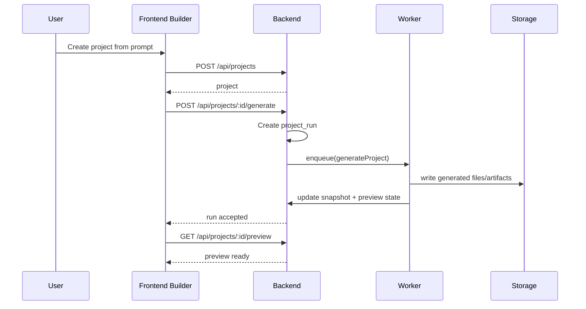
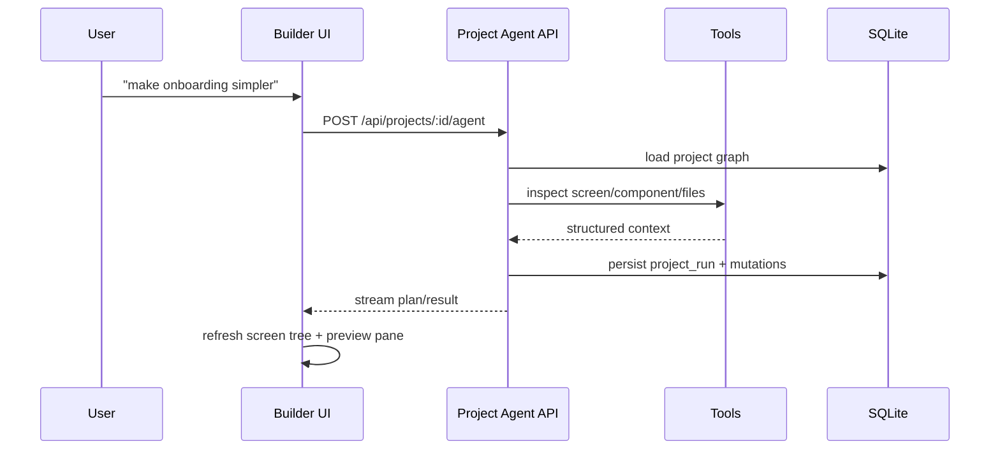

# Design: 002 — Project-First Builder

## Technical Approach

Shift DevMind from a conversation-centered architecture to a project-centered architecture. The existing chat runtime remains as a supporting subsystem, but the primary lifecycle becomes:

`project -> design graph -> generation plan -> preview runtime -> backend resources -> publish`

The implementation should be additive-first and preserve the working backend/frontend/workers split already present in the monorepo.

---

## 1. Architecture Overview

### Current

```
frontend
  -> sessions
  -> chat stream
  -> artifacts

backend
  -> auth
  -> sessions/messages/agent_runs
  -> tools
  -> storage
  -> flags

workers
  -> indexCodebase
  -> archiveSessions
```

### Target

```
frontend
  -> projects
  -> builder shell
  -> design surfaces
  -> app preview
  -> project-scoped agent

backend
  -> project repos
  -> design graph repos
  -> generation orchestration APIs
  -> preview environment APIs
  -> app backend resource APIs
  -> project-scoped chat/agent APIs

workers
  -> generate project snapshots
  -> sync preview runtime
  -> index generated code
  -> publish/promote builds
```

### Primary Domain Objects

| Domain | Purpose | Example Records |
|--------|---------|-----------------|
| `projects` | top-level app container | title, slug, status |
| `screens` | app routes/pages | home, settings, onboarding |
| `components` | reusable UI blocks | navbar, form, card |
| `data_sources` | Firebase-like app resources | collection, storage bucket, realtime channel |
| `project_runs` | generation/refinement executions | draft generation, screen rewrite |
| `previews` | running or materialized preview state | port, build hash, snapshot id |

---

## 2. Architectural Decisions

### AD-1: Project is the system root

The backend SHALL treat `project` as the root aggregate. Screens, components, files, resources, runs, and chats belong to a project.

Rationale:
- matches the target product
- makes preview and publish durable
- prevents chat history from being the only persistent source of intent

### AD-2: Chat becomes project-scoped, not platform-scoped

Existing `sessions` MAY remain during migration, but new agent activity SHALL attach to a `project_id`. The agent is an editor of project state, not the container of project state.

### AD-3: Generated app backend is separate from DevMind backend

DevMind backend continues to authenticate DevMind users and orchestrate jobs. Generated apps SHALL be modeled as separate logical resources:

- app auth config
- app collections
- app storage
- app realtime channels
- app background jobs

These resources may reuse the same underlying infrastructure at first, but the domain boundary must be explicit.

### AD-4: Preview is a first-class subsystem

Preview SHALL not be inferred from chat output. It must have explicit state, artifacts, and lifecycle:

- requested
- building
- ready
- failed
- stale

### AD-5: Generation is snapshot-based

Every significant generation/refinement run SHOULD produce a project snapshot. This gives rollback, diff, publish, and preview coherence.

---

## 3. Package-Level Design

### `packages/backend`

Add builder-centric modules:

```text
packages/backend/src/
  builder/
    routes.ts
    preview-routes.ts
    generation-routes.ts
  db/repos/
    projects.ts
    screens.ts
    components.ts
    data-sources.ts
    previews.ts
    project-runs.ts
```

Responsibilities:
- CRUD for projects and screens
- orchestration endpoints for generation and preview
- project-scoped agent execution
- mapping generated app resources to storage, DB, realtime, and jobs

### `packages/frontend`

Add a builder shell instead of leading with session sidebar:

```text
packages/frontend/src/
  pages/
    Projects.tsx
    Builder.tsx
  components/
    builder/
      ProjectSidebar.tsx
      ScreenTree.tsx
      PreviewPane.tsx
      PromptPanel.tsx
```

Responsibilities:
- project navigation
- screen selection and layout
- prompt-to-screen editing loop
- live preview inspection

### `packages/workers`

Add project workers:

```text
packages/workers/src/handlers/
  generate-project.ts
  rebuild-preview.ts
  publish-project.ts
  index-generated-app.ts
```

Responsibilities:
- transform project graph into code/artifacts
- update preview artifacts
- index generated code for project-aware semantic search
- promote preview snapshots to publishable outputs

---

## 4. Data Model Migration

### Existing Tables

- `sessions`
- `messages`
- `tasks`
- `agent_runs`
- `artifacts`

### New Tables

- `projects`
- `project_members`
- `screens`
- `components`
- `project_files`
- `data_sources`
- `previews`
- `project_runs`
- `project_snapshots`

### Migration Rule

The migration SHALL be additive-first:

1. add new builder tables
2. add `project_id` foreign keys where needed
3. expose new APIs in parallel
4. migrate frontend navigation to projects
5. deprecate session-first entry points only after builder parity

---

## 5. Request Flows

### Flow A: Create Project and Generate First Screen



### Flow B: Edit Screen with Agent



---

## 6. Transitional Architecture

The first implementation phase SHOULD keep these subsystems intact:

- auth
- storage
- flags
- current worker queue
- current chat runtime

The transition changes what they serve:

- storage serves generated app artifacts and preview outputs
- workers serve generation and preview jobs
- chat serves project refinement

---

## 7. Non-Goals for This Change

- full visual freeform design tool
- multi-runtime deployment matrix
- replacing local Ollama with hosted model providers

---

## 8. First Executable Slice

The first slice should be intentionally narrow:

1. create `projects` and `screens` tables/repos
2. add a frontend project list
3. add project detail page with placeholder preview pane
4. attach chat to `project_id`
5. enqueue a `generateProject` worker job from backend

This slice changes the product center of gravity without requiring the full builder to exist on day one.
