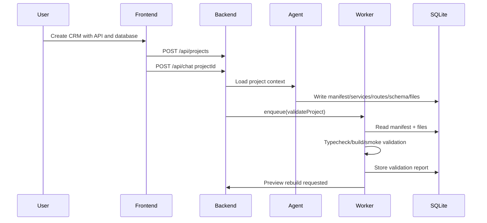
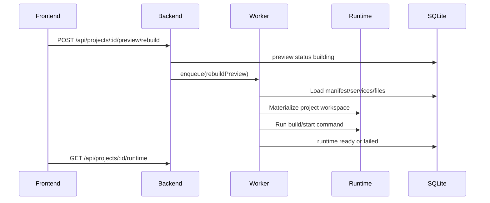

# Design: 003 — Full-Stack Project Generator

## Technical Approach

DevMind SHALL use a spec-driven generated-app contract. The project model becomes the durable source of truth; files are generated and edited as materialized outputs.

The migration proceeds in vertical slices:

1. manifest and project shape
2. static frontend generation parity
3. API/backend service generation
4. database schema and migrations
5. preview runtime and validation
6. snapshots, rollback, and publish

---

## 1. Target Architecture

```text
frontend builder
  -> project overview
  -> files/editor
  -> screens/components
  -> services
  -> API routes
  -> database
  -> auth/storage/jobs
  -> validation reports
  -> preview runtime

backend
  -> project aggregate APIs
  -> manifest/resource APIs
  -> project-scoped agent
  -> generation orchestration
  -> validation orchestration
  -> preview runtime metadata

workers
  -> generate project from manifest
  -> validate generated project
  -> rebuild static/service preview
  -> create/restore snapshots

generated project
  -> frontend service
  -> backend service
  -> database migrations
  -> env schema
  -> runtime commands
```

---

## 2. Generated App Contract

Every project SHOULD have a `project_manifest` record.

Example logical shape:

```json
{
  "version": 1,
  "appType": "fullstack-web",
  "stack": {
    "frontend": "static|react-vite",
    "backend": "hono-node|none",
    "database": "sqlite|none",
    "auth": "none|email-password|totp"
  },
  "commands": {
    "dev": "pnpm dev",
    "build": "pnpm build",
    "test": "pnpm test",
    "start": "pnpm start"
  },
  "entrypoints": {
    "frontend": "frontend/index.html",
    "backend": "backend/src/index.ts"
  }
}
```

### Manifest Rules

- The manifest MUST be project-scoped.
- The manifest MUST be versioned.
- The manifest SHOULD define services, commands, env requirements, and runtime type.
- The manifest SHALL NOT store secrets directly.
- Generated files SHOULD be validated against the manifest after generation.

---

## 3. Data Model

Additive migrations:

```text
project_manifests
  id, project_id, version, app_type, stack_json, commands_json, entrypoints_json

project_services
  id, project_id, kind, name, root_path, runtime, port, status, config_json

project_api_routes
  id, project_id, service_id, method, path, handler_path, request_schema_json, response_schema_json

project_db_schemas
  id, project_id, engine, name, schema_json

project_db_migrations
  id, project_id, schema_id, version, name, content, status, applied_at

project_env_vars
  id, project_id, service_id, name, required, secret_ref, default_value, description

project_snapshots
  id, project_id, run_id, manifest_json, file_tree_json, resource_graph_json, created_at

project_validation_reports
  id, project_id, run_id, status, checks_json, log_excerpt, created_at

project_runtime_instances
  id, project_id, preview_id, status, frontend_url, backend_url, ports_json, error
```

Existing tables retained:

- `projects`
- `screens`
- `components`
- `project_files`
- `app_resources`
- `previews`
- `project_runs`
- `sessions`
- `messages`

---

## 4. Backend Modules

Target structure:

```text
packages/backend/src/
  builder/
    routes.ts
    manifest-routes.ts
    service-routes.ts
    api-route-routes.ts
    database-routes.ts
    validation-routes.ts
    runtime-routes.ts
  db/repos/
    project-manifests.ts
    project-services.ts
    project-api-routes.ts
    project-db-schemas.ts
    project-db-migrations.ts
    project-env-vars.ts
    project-snapshots.ts
    project-validation-reports.ts
    project-runtime-instances.ts
```

Use Zod at route boundaries and repo methods that keep JSON parsing/stringifying centralized.

---

## 5. Agent Tooling

Add project-structured tools:

```text
read_project_manifest
update_project_manifest
create_project_service
upsert_api_route
upsert_database_schema
create_database_migration
upsert_env_var
create_project_snapshot
request_project_validation
request_preview_rebuild
```

Existing file tools remain:

```text
write_project_file
read_project_file
list_project_files
```

Agent behavior:

- For static UI tasks, the agent MAY write files directly.
- For full-stack tasks, the agent MUST update structured resources first or alongside files.
- API/database/backend changes MUST produce structured route/schema/migration records.
- The final assistant response SHOULD summarize generated services, files, and validation state.

---

## 6. Worker Flows

### Flow A: Generate Full-Stack Project



### Flow B: Preview Runtime



---

## 7. Preview Strategy

### Phase 1: Static Compatibility

Keep current route:

```text
GET /api/projects/:id/preview/serve/index.html
```

### Phase 2: Materialized Workspace

Workers materialize generated files into:

```text
workspace/generated-projects/:projectId/:snapshotId/
```

### Phase 3: Service Preview

For full-stack apps, preview metadata points to:

```text
frontend_url
backend_url
runtime status
logs
ports
```

The runtime SHOULD initially run only trusted local commands from manifest allowlists. Container isolation MAY be added after the first working slice.

---

## 8. Frontend Builder IA

Refactor builder UI into domains:

```text
components/builder/
  ProjectSidebar.tsx
  FileExplorer.tsx
  EditorPane.tsx
  PreviewPane.tsx
  PromptPanel.tsx
  ServicesPanel.tsx
  ApiRoutesPanel.tsx
  DatabasePanel.tsx
  ResourcesPanel.tsx
  ValidationPanel.tsx
  RuntimePanel.tsx
```

The builder SHOULD make full-stack state visible:

- files
- screens
- services
- API routes
- database schema
- app resources
- env vars
- preview/runtime status
- validation reports

---

## 9. Security Design

- Generated app secrets MUST be referenced by secret key/ref, not stored as values in SQLite.
- Preview runtime commands MUST be selected from a controlled manifest allowlist.
- Public iframe preview routes SHOULD use signed preview tokens or scoped preview tickets.
- Agent command execution SHOULD be separated from generated app runtime execution.
- Project workspaces MUST resolve inside configured `WORKSPACE_ROOT`.
- Runtime logs SHOULD be truncated before storage and display.

---

## 10. Implementation Order

1. Add schema/repos/routes for manifest, services, API routes, database schemas, env vars, validation reports.
2. Add frontend panels that read/write those resources manually.
3. Add agent tools that mutate those resources.
4. Teach system prompt to choose full-stack mode when the user requests backend/API/BBDD.
5. Implement validation worker over virtual project files.
6. Implement materialized workspace preview.
7. Add snapshots and restore.
8. Harden runtime security.
